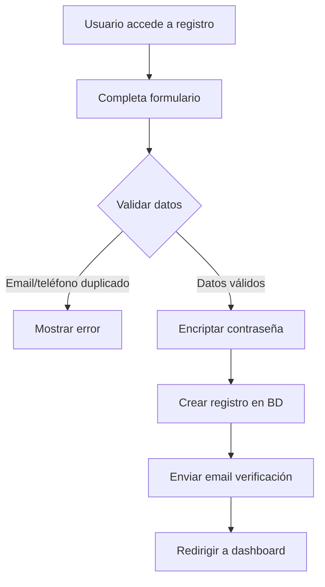
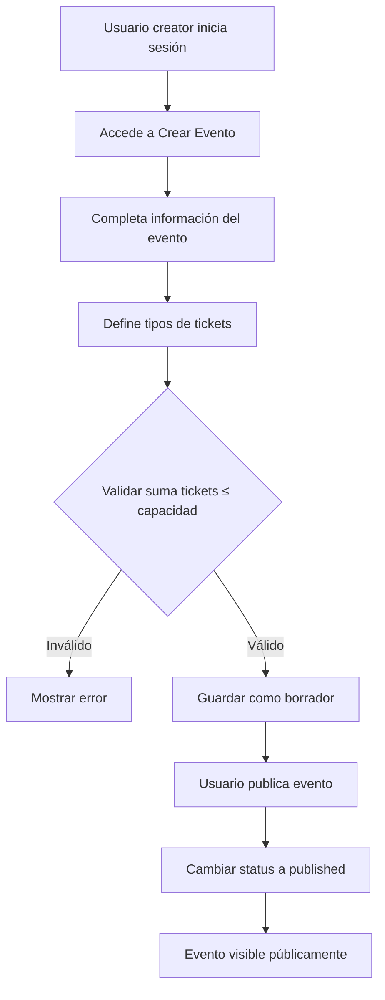
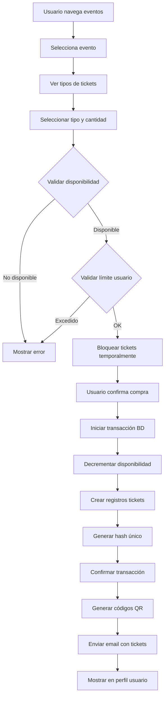
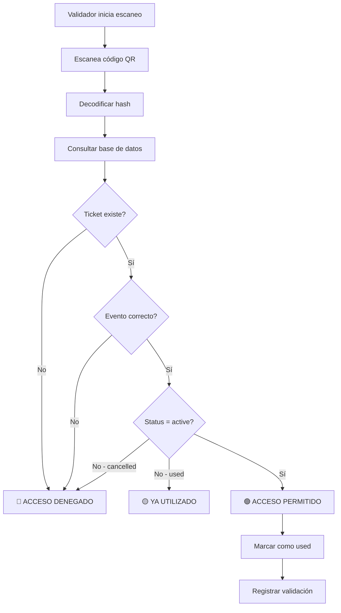

# 🎫 Sistema de Gestión de Eventos y Tickets


> **Documentación Técnica Completa**
> Sistema web para la gestión integral de eventos con tickets digitales y validación QR

---

## 📑 Tabla de Contenidos

-   [1. Descripción General](#1-descripción-general)
    -   [1.1 Descripción del Proyecto](#11-descripción-del-proyecto)
    -   [1.2 Propósito](#12-propósito)
    -   [1.3 Alcance](#13-alcance)
    -   [1.4 Objetivos](#14-objetivos)
-   [2. Requerimientos Funcionales](#2-requerimientos-funcionales)
    -   [2.1 Autenticación y Usuarios](#21-módulo-de-autenticación-y-gestión-de-usuarios)
    -   [2.2 Eventos](#22-módulo-de-eventos)
    -   [2.3 Tipos de Ticket](#23-módulo-de-tipos-de-ticket)
    -   [2.4 Tickets](#24-módulo-de-tickets)
    -   [2.5 Validación](#25-módulo-de-validación)
-   [3. Requerimientos No Funcionales](#3-requerimientos-no-funcionales)
-   [4. Modelo de Datos](#4-modelo-de-datos)
-   [5. Flujos de Trabajo](#5-flujos-de-trabajo)
-   [6. Roles de Usuario](#6-roles-de-usuario)
-   [7. Interfaces de Usuario](#7-interfaces-de-usuario)

---

## 1. Descripción General

### 1.1 Descripción del Proyecto

El proyecto soluciona la problemática de la gestión manual y desorganizada de eventos, abordando dificultades como el control de aforo, la prevención del fraude en la venta de entradas y la garantía de un acceso seguro y ágil. También resuelve la falta de trazabilidad en la distribución de tickets y los riesgos de falsificación o duplicación de entradas físicas, que generan pérdidas económicas y problemas de seguridad.

Se implementará un sistema web que digitaliza el ciclo completo de los eventos, desde su creación hasta la validación de acceso. Incluye módulos para gestionar usuarios con distintos roles (compradores, creadores de eventos, validadores y administradores), permitiendo la creación y configuración de eventos con múltiples tipos de tickets, venta automatizada con control de disponibilidad en tiempo real, generación de códigos QR únicos y encriptados, y un sistema de validación por escaneo que registra cada acceso y evita el uso duplicado. La arquitectura asegura transacciones atómicas para prevenir sobreventa y ofrece estadísticas en tiempo real.

El servicio está dirigido a tres perfiles principales:
• Organizadores de eventos (empresas, instituciones, asociaciones) que necesitan una plataforma centralizada para una gestión profesional y segura.
• Asistentes o compradores que buscan adquirir tickets digitales de forma instantánea y acceder a ellos desde cualquier dispositivo.
• Personal de validación en punto s de acceso, que requiere una herramienta ágil para verificar tickets mediante escaneo QR, garantizando un flujo eficiente.

La aplicación automatiza completamente la venta y distribución de tickets digitales, eliminando la necesidad de entradas físicas y reduciendo costos operativos. Ofrece a los organizadores control total sobre el aforo con actualizaciones en tiempo real, estadísticas detalladas y la capacidad de gestionar múltiples tipos de tickets. Los usuarios finales disfrutan de la comodidad de comprar en cualquier lugar, recibir tickets por correo, descargarlos en PDF y presentarlos digitalmente. El sistema garantiza seguridad mediante encriptación, códigos QR con firma digital antifalsificación y validación instantánea que detecta fraudes, todo accesible desde dispositivos móviles y ordenadores.

### 1.2 Propósito

Sistema web para la **gestión integral de eventos** que permite a organizadores crear y gestionar eventos con capacidad limitada, mientras que los usuarios pueden adquirir tickets digitales con código QR único para su validación en el acceso al evento.

### 1.3 Alcance

La aplicación facilita todo el ciclo de vida de un evento:

```
┌─────────────┐    ┌─────────────┐    ┌─────────────┐    ┌─────────────┐
│  Creación   │ -> │   Venta de  │ -> │ Distribución│ -> │ Validación  │
│  de Evento  │    │   Tickets   │    │   Digital   │    │   de QR     │
└─────────────┘    └─────────────┘    └─────────────┘    └─────────────┘
```

### 1.4 Objetivos

| #   | Objetivo                                                            |
| --- | ------------------------------------------------------------------- |
| 🎯  | Proporcionar una plataforma centralizada para la gestión de eventos |
| 🎯  | Automatizar el proceso de venta y distribución de tickets digitales |
| 🎯  | Garantizar la seguridad en el acceso mediante validación QR         |
| 🎯  | Prevenir fraudes y duplicación de tickets                           |
| 🎯  | Optimizar el control de aforo en eventos                            |

---

## 2. Requerimientos Funcionales

### 2.1 Módulo de Autenticación y Gestión de Usuarios

#### RF-01: Registro de usuarios

| Aspecto              | Descripción                                                        |
| -------------------- | ------------------------------------------------------------------ |
| **Descripción**      | El sistema permitirá el registro de nuevos usuarios                |
| **Datos requeridos** | Email, teléfono, nombre, apellido, contraseña                      |
| **Validaciones**     | Unicidad de email y teléfono, criterios de seguridad de contraseña |

#### RF-02: Inicio de sesión

| Aspecto         | Descripción                                                  |
| --------------- | ------------------------------------------------------------ |
| **Descripción** | Los usuarios podrán autenticarse mediante email y contraseña |
| **Resultado**   | Generación de tokens de sesión seguros                       |

#### RF-03: Gestión de roles

| Rol         | Descripción             |
| ----------- | ----------------------- |
| `buyer`     | Comprador (por defecto) |
| `creator`   | Creador de Eventos      |
| `validator` | Validador               |
| `admin`     | Administrador           |

#### RF-04: Recuperación de contraseña

| Aspecto         | Descripción                                                             |
| --------------- | ----------------------------------------------------------------------- |
| **Descripción** | El sistema permitirá solicitar restablecimiento de contraseña vía email |

---

### 2.2 Módulo de Eventos

#### RF-05: Creación de eventos

| Aspecto              | Descripción                           |
| -------------------- | ------------------------------------- |
| **Rol requerido**    | `creator`                             |
| **Datos requeridos** | Nombre del evento, capacidad máxima   |
| **Validaciones**     | Capacidad debe ser un número positivo |

#### RF-06: Listado de eventos

| Aspecto                  | Descripción                      |
| ------------------------ | -------------------------------- |
| **Acceso**               | Todos los usuarios               |
| **Información mostrada** | Nombre, aforo disponible, estado |

#### RF-07: Edición de eventos

| Aspecto                      | Descripción                                        |
| ---------------------------- | -------------------------------------------------- |
| **Restricción temporal**     | Solo antes de que comience la venta                |
| **Restricción de capacidad** | No se puede reducir por debajo de tickets vendidos |

#### RF-08: Cancelación de eventos

| Aspecto          | Descripción                                       |
| ---------------- | ------------------------------------------------- |
| **Acción**       | Los creadores pueden cancelar eventos             |
| **Notificación** | Sistema notifica a usuarios con tickets comprados |

---

### 2.3 Módulo de Tipos de Ticket

#### RF-09: Definición de tipos de ticket

Cada evento puede tener múltiples tipos de tickets:

| Campo         | Descripción            | Ejemplo                           |
| ------------- | ---------------------- | --------------------------------- |
| `nombre`      | Identificador del tipo | VIP, General, Estudiante          |
| `descripción` | Detalles del tipo      | Acceso preferente, zona exclusiva |
| `precio`      | Costo unitario         | €50.00                            |
| `cantidad`    | Unidades disponibles   | 100                               |

#### RF-10: Gestión de disponibilidad

```
⚠️ REGLA: Σ(tickets por tipo) ≤ capacidad_máxima_evento
```

---

### 2.4 Módulo de Tickets

#### RF-11: Compra de tickets

| Aspecto         | Descripción                            |
| --------------- | -------------------------------------- |
| **Requisito**   | Usuario registrado y autenticado       |
| **Límite**      | Máximo de tickets por usuario y evento |
| **Transacción** | Atómica para evitar sobreventa         |

#### RF-12: Generación de código QR

```
┌─────────────────────────────────┐
│  ██████████████████████████████ │
│  ██                          ██ │
│  ██  ████████████████████    ██ │
│  ██  ██              ██  ██  ██ │
│  ██  ██  ██████████  ██  ██  ██ │
│  ██  ██  ██      ██  ██  ██  ██ │
│  ██  ██  ██████████  ██  ██  ██ │
│  ██  ██              ██  ██  ██ │
│  ██  ████████████████████    ██ │
│  ██                          ██ │
│  ██████████████████████████████ │
│                                 │
│  Hash único + Datos encriptados │
└─────────────────────────────────┘
```

#### RF-13: Visualización de tickets

| Información mostrada |
| -------------------- |
| ✅ Evento asociado   |
| ✅ Tipo de ticket    |
| ✅ Código QR         |
| ✅ Estado actual     |

#### RF-14: Envío de tickets

> 📧 El sistema enviará el ticket con QR al email del usuario tras la compra exitosa.

#### RF-15: Descarga de tickets

> 📄 Los usuarios podrán descargar sus tickets en **formato PDF**.

---

### 2.5 Módulo de Validación

#### RF-16: Escaneo de QR

| Aspecto           | Descripción                      |
| ----------------- | -------------------------------- |
| **Dispositivo**   | Cámara del dispositivo móvil/web |
| **Rol requerido** | `validator`                      |

#### RF-17: Validación de ticket

```
Verificaciones realizadas:
├── ✓ Autenticidad del ticket
├── ✓ Correspondencia con evento correcto
└── ✓ Estado del ticket (no usado previamente)
```

#### RF-18: Registro de acceso

| Campo registrado | Descripción                |
| ---------------- | -------------------------- |
| `validated_at`   | Fecha y hora de validación |
| `status`         | Cambio a "utilizado"       |

#### RF-19: Respuesta de validación

| Estado      | Color       | Mensaje             |
| ----------- | ----------- | ------------------- |
| ✅ Válido   | 🟢 Verde    | Acceso permitido    |
| ⚠️ Ya usado | 🟡 Amarillo | Ticket ya utilizado |
| ❌ Inválido | 🔴 Rojo     | Acceso denegado     |

#### RF-20: Estadísticas de acceso

> 📊 Los organizadores pueden ver estadísticas en **tiempo real** de accesos validados.

---

## 3. Requerimientos No Funcionales

### 3.1 🔒 Seguridad

| ID     | Requisito                   | Especificación                          |
| ------ | --------------------------- | --------------------------------------- |
| RNF-01 | Encriptación de contraseñas | bcrypt / Argon2                         |
| RNF-02 | Protección de códigos QR    | Firma digital                           |
| RNF-03 | Comunicación segura         | HTTPS/TLS                               |
| RNF-04 | Autenticación de sesiones   | JWT con expiración                      |
| RNF-05 | Prevención de ataques       | SQL Injection, XSS, CSRF, Rate Limiting |

### 3.2 ⚡ Rendimiento

| ID     | Requisito                     | Métrica                        |
| ------ | ----------------------------- | ------------------------------ |
| RNF-06 | Tiempo de respuesta (lectura) | < 2 segundos                   |
| RNF-06 | Tiempo de validación QR       | < 1 segundo                    |
| RNF-07 | Concurrencia                  | Sin sobreventa                 |
| RNF-08 | Capacidad                     | ≥ 10,000 usuarios concurrentes |

### 3.3 📈 Escalabilidad

| ID     | Requisito     | Descripción                        |
| ------ | ------------- | ---------------------------------- |
| RNF-09 | Arquitectura  | Escalado horizontal de servidores  |
| RNF-10 | Base de datos | Soporte para millones de registros |

### 3.4 🎨 Usabilidad

| ID     | Requisito          | Descripción                |
| ------ | ------------------ | -------------------------- |
| RNF-11 | Interfaz intuitiva | Sin capacitación previa    |
| RNF-12 | Responsive design  | Móvil, tablet y escritorio |
| RNF-13 | Accesibilidad      | WCAG 2.1 nivel AA          |

### 3.5 🔄 Disponibilidad

| ID     | Requisito | Métrica       |
| ------ | --------- | ------------- |
| RNF-14 | Uptime    | 99.5% mensual |
| RNF-15 | RTO       | < 1 hora      |

### 3.6 🛠️ Mantenibilidad

| ID     | Requisito     | Descripción                             |
| ------ | ------------- | --------------------------------------- |
| RNF-16 | Código limpio | Principios SOLID, patrones de diseño    |
| RNF-17 | Documentación | OpenAPI/Swagger                         |
| RNF-18 | Logging       | Logs detallados de operaciones críticas |

---

## 4. Modelo de Datos

### 4.1 Diagrama Entidad-Relación

```
┌─────────────────┐       ┌─────────────────┐       ┌─────────────────┐
│     USERS       │       │     EVENTS      │       │  TICKET_TYPES   │
├─────────────────┤       ├─────────────────┤       ├─────────────────┤
│ PK id           │       │ PK id           │       │ PK id           │
│    email        │       │    name         │       │ FK event_id     │
│    phone        │       │    description  │       │    name         │
│    name         │       │    max_capacity │       │    description  │
│    last_name    │◄──────│ FK creator_id   │──────►│    price        │
│    role         │       │    location     │       │    quantity     │
│    password     │       │    event_date   │       │    max_per_user │
│    created_at   │       │    start_sale   │       │    created_at   │
│    updated_at   │       │    end_sale     │       └────────┬────────┘
│    email_verified       │    status       │                │
│    is_active    │       │    created_at   │                │
└────────┬────────┘       │    updated_at   │                │
         │                └────────┬────────┘                │
         │                         │                         │
         │                         │                         │
         ▼                         ▼                         ▼
┌─────────────────────────────────────────────────────────────────────┐
│                              TICKETS                                 │
├─────────────────────────────────────────────────────────────────────┤
│ PK id                                                                │
│ FK event_id ─────────────────────────────────────────────────────────┤
│ FK user_id ──────────────────────────────────────────────────────────┤
│ FK type_id ──────────────────────────────────────────────────────────┤
│    hash (UNIQUE)                                                     │
│    status                                                            │
│    purchase_date                                                     │
│    validated_at                                                      │
│ FK validated_by                                                      │
│    created_at                                                        │
└─────────────────────────────────────────────────────────────────────┘
```

### 4.2 Tabla: `users`

| Campo            | Tipo         | Restricciones               | Descripción                              |
| ---------------- | ------------ | --------------------------- | ---------------------------------------- |
| `id`             | UUID/BIGINT  | PRIMARY KEY, AUTO_INCREMENT | Identificador único                      |
| `email`          | VARCHAR(255) | NOT NULL, UNIQUE            | Email del usuario                        |
| `phone`          | VARCHAR(20)  | UNIQUE, NULL                | Teléfono de contacto                     |
| `name`           | VARCHAR(100) | NOT NULL                    | Nombre del usuario                       |
| `last_name`      | VARCHAR(100) | NOT NULL                    | Apellido del usuario                     |
| `role`           | ENUM         | NOT NULL, DEFAULT 'buyer'   | 'buyer', 'creator', 'validator', 'admin' |
| `password`       | VARCHAR(255) | NOT NULL                    | Hash de contraseña                       |
| `created_at`     | TIMESTAMP    | DEFAULT CURRENT_TIMESTAMP   | Fecha de registro                        |
| `updated_at`     | TIMESTAMP    | ON UPDATE CURRENT_TIMESTAMP | Última actualización                     |
| `email_verified` | BOOLEAN      | DEFAULT FALSE               | Estado de verificación                   |
| `is_active`      | BOOLEAN      | DEFAULT TRUE                | Estado de la cuenta                      |

**Índices:**

```sql
PRIMARY KEY (id)
UNIQUE INDEX idx_users_email (email)
INDEX idx_users_role (role)
```

### 4.3 Tabla: `events`

| Campo          | Tipo         | Restricciones               | Descripción                                             |
| -------------- | ------------ | --------------------------- | ------------------------------------------------------- |
| `id`           | UUID/BIGINT  | PRIMARY KEY, AUTO_INCREMENT | Identificador único                                     |
| `name`         | VARCHAR(255) | NOT NULL                    | Nombre del evento                                       |
| `description`  | TEXT         | NULL                        | Descripción detallada                                   |
| `max_capacity` | INT          | NOT NULL, CHECK > 0         | Capacidad máxima                                        |
| `creator_id`   | UUID/BIGINT  | NOT NULL, FOREIGN KEY       | Creador del evento                                      |
| `location`     | VARCHAR(255) | NULL                        | Ubicación del evento                                    |
| `event_date`   | TIMESTAMP    | NULL                        | Fecha y hora del evento                                 |
| `start_sale`   | TIMESTAMP    | NULL                        | Inicio de venta                                         |
| `end_sale`     | TIMESTAMP    | NULL                        | Fin de venta                                            |
| `status`       | ENUM         | DEFAULT 'draft'             | 'draft', 'published', 'active', 'finished', 'cancelled' |
| `created_at`   | TIMESTAMP    | DEFAULT CURRENT_TIMESTAMP   | Fecha de creación                                       |
| `updated_at`   | TIMESTAMP    | ON UPDATE CURRENT_TIMESTAMP | Última actualización                                    |

**Índices:**

```sql
PRIMARY KEY (id)
FOREIGN KEY (creator_id) REFERENCES users(id)
INDEX idx_events_status (status)
INDEX idx_events_date (event_date)
```

### 4.4 Tabla: `ticket_types`

| Campo                | Tipo          | Restricciones               | Descripción         |
| -------------------- | ------------- | --------------------------- | ------------------- |
| `id`                 | UUID/BIGINT   | PRIMARY KEY, AUTO_INCREMENT | Identificador único |
| `event_id`           | UUID/BIGINT   | NOT NULL, FOREIGN KEY       | Evento asociado     |
| `name`               | VARCHAR(100)  | NOT NULL                    | Nombre del tipo     |
| `description`        | TEXT          | NULL                        | Descripción         |
| `price`              | DECIMAL(10,2) | NOT NULL, CHECK >= 0        | Precio del ticket   |
| `quantity_available` | INT           | NOT NULL, CHECK >= 0        | Cantidad disponible |
| `max_per_user`       | INT           | DEFAULT 5                   | Máximo por usuario  |
| `created_at`         | TIMESTAMP     | DEFAULT CURRENT_TIMESTAMP   | Fecha de creación   |

**Índices:**

```sql
PRIMARY KEY (id)
FOREIGN KEY (event_id) REFERENCES events(id) ON DELETE CASCADE
INDEX idx_ticket_types_event (event_id)
```

### 4.5 Tabla: `tickets`

| Campo           | Tipo         | Restricciones               | Descripción                               |
| --------------- | ------------ | --------------------------- | ----------------------------------------- |
| `id`            | UUID/BIGINT  | PRIMARY KEY, AUTO_INCREMENT | Identificador único                       |
| `event_id`      | UUID/BIGINT  | NOT NULL, FOREIGN KEY       | Evento asociado                           |
| `user_id`       | UUID/BIGINT  | NOT NULL, FOREIGN KEY       | Comprador                                 |
| `type_id`       | UUID/BIGINT  | NOT NULL, FOREIGN KEY       | Tipo de ticket                            |
| `hash`          | VARCHAR(255) | NOT NULL, UNIQUE            | Hash único para QR                        |
| `status`        | ENUM         | DEFAULT 'active'            | 'active', 'used', 'cancelled', 'refunded' |
| `purchase_date` | TIMESTAMP    | DEFAULT CURRENT_TIMESTAMP   | Fecha de compra                           |
| `validated_at`  | TIMESTAMP    | NULL                        | Fecha de validación                       |
| `validated_by`  | UUID/BIGINT  | NULL, FOREIGN KEY           | Usuario validador                         |
| `created_at`    | TIMESTAMP    | DEFAULT CURRENT_TIMESTAMP   | Fecha de creación                         |

**Índices:**

```sql
PRIMARY KEY (id)
UNIQUE INDEX idx_tickets_hash (hash)
FOREIGN KEY (event_id) REFERENCES events(id)
FOREIGN KEY (user_id) REFERENCES users(id)
FOREIGN KEY (type_id) REFERENCES ticket_types(id)
FOREIGN KEY (validated_by) REFERENCES users(id)
INDEX idx_tickets_user_event (user_id, event_id)
INDEX idx_tickets_status (status)
```

### 4.6 Tabla: `transactions` _(Opcional - Auditoría)_

| Campo            | Tipo          | Restricciones               | Descripción                      |
| ---------------- | ------------- | --------------------------- | -------------------------------- |
| `id`             | UUID/BIGINT   | PRIMARY KEY, AUTO_INCREMENT | Identificador único              |
| `user_id`        | UUID/BIGINT   | NOT NULL, FOREIGN KEY       | Usuario comprador                |
| `event_id`       | UUID/BIGINT   | NOT NULL, FOREIGN KEY       | Evento                           |
| `total_amount`   | DECIMAL(10,2) | NOT NULL                    | Monto total                      |
| `payment_method` | VARCHAR(50)   | NULL                        | Método de pago                   |
| `status`         | ENUM          | DEFAULT 'pending'           | 'pending', 'completed', 'failed' |
| `created_at`     | TIMESTAMP     | DEFAULT CURRENT_TIMESTAMP   | Fecha de transacción             |

---

## 5. Flujos de Trabajo

### 5.1 Flujo de Registro de Usuario



**Pasos detallados:**

1. ▶️ Usuario accede a página de registro
2. 📝 Usuario completa formulario (email, teléfono, nombre, apellido, contraseña)
3. ✅ Sistema valida datos:
    - Email único
    - Teléfono único (si se proporciona)
    - Contraseña cumple requisitos
4. 🔐 Sistema encripta contraseña
5. 💾 Sistema crea registro en tabla `users` con rol `'buyer'`
6. 📧 Sistema envía email de verificación
7. ✔️ Usuario confirma email _(opcional)_
8. 🏠 Sistema redirige a dashboard

---

### 5.2 Flujo de Creación de Evento



**Información requerida:**

| Sección             | Campos                                                                   |
| ------------------- | ------------------------------------------------------------------------ |
| **Evento**          | Nombre, Descripción, Capacidad máxima, Ubicación, Fecha, Fechas de venta |
| **Tipos de Ticket** | Para cada tipo: nombre, precio, cantidad, máximo por usuario             |

---

### 5.3 Flujo de Compra de Ticket



**Transacción de base de datos:**

```sql
BEGIN TRANSACTION;
  -- a) Decrementar disponibilidad
  UPDATE ticket_types SET quantity_available = quantity_available - :cantidad
  WHERE id = :type_id AND quantity_available >= :cantidad;

  -- b) Crear registros de tickets
  INSERT INTO tickets (event_id, user_id, type_id, hash, status)
  VALUES (:event_id, :user_id, :type_id, :generated_hash, 'active');

COMMIT;
```

---

### 5.4 Flujo de Validación de Ticket



**Casos de respuesta:**

| Caso             | Condición                                                                    | Acción                                   | Respuesta Visual                                   |
| ---------------- | ---------------------------------------------------------------------------- | ---------------------------------------- | -------------------------------------------------- |
| **A - Válido**   | Status = 'active', evento coincide                                           | Marcar como 'used', registrar validación | 🟢 **ACCESO PERMITIDO** + datos del titular        |
| **B - Ya usado** | Status = 'used'                                                              | Solo mostrar información                 | 🟡 **TICKET YA UTILIZADO** + fecha/hora uso previo |
| **C - Inválido** | No existe, hash incorrecto, evento incorrecto, status 'cancelled'/'refunded' | Registrar en logs de seguridad           | 🔴 **ACCESO DENEGADO**                             |

---

## 6. Roles de Usuario

### 6.1 👤 Comprador (Buyer)

<table>
<tr>
<td width="50%">

**✅ Permisos**

-   Ver listado de eventos públicos
-   Ver detalles de eventos
-   Comprar tickets (dentro de límites)
-   Ver sus propios tickets
-   Descargar tickets en PDF
-   Gestionar su perfil

</td>
<td width="50%">

**❌ Restricciones**

-   No puede crear eventos
-   No puede validar tickets
-   Solo puede ver sus propias compras

</td>
</tr>
</table>

---

### 6.2 🎭 Creador de Eventos (Event Creator)

<table>
<tr>
<td width="50%">

**✅ Permisos**

-   _Todos los permisos de Comprador_
-   Crear nuevos eventos
-   Editar eventos propios
-   Definir tipos de tickets
-   Ver estadísticas de sus eventos
-   Cancelar eventos propios
-   Ver listado de tickets vendidos
-   Exportar datos de ventas

</td>
<td width="50%">

**❌ Restricciones**

-   No puede editar eventos de otros
-   No puede validar tickets (sin rol adicional)

</td>
</tr>
</table>

---

### 6.3 ✅ Validador (Validator)

<table>
<tr>
<td width="50%">

**✅ Permisos**

-   Acceder a modo de escaneo QR
-   Validar tickets
-   Ver historial de validaciones
-   Ver estadísticas de acceso en tiempo real

</td>
<td width="50%">

**❌ Restricciones**

-   Solo puede validar eventos asignados
-   No puede crear eventos
-   No puede comprar en modo validador

</td>
</tr>
</table>

---

### 6.4 👑 Administrador (Admin)

<table>
<tr>
<td width="50%">

**✅ Permisos**

-   _Todos los permisos del sistema_
-   Gestionar usuarios (CRUD, cambiar roles)
-   Ver todos los eventos
-   Editar/cancelar cualquier evento
-   Ver todas las transacciones
-   Panel de administración
-   Ver logs del sistema
-   Configurar parámetros

</td>
<td width="50%">

**📋 Responsabilidades**

-   Moderación de contenido
-   Resolución de conflictos
-   Gestión de incidencias
-   Monitoreo del sistema

</td>
</tr>
</table>

---

## 7. Interfaces de Usuario

### 7.1 🌐 Pantallas Públicas (Sin autenticación)

#### 7.1.1 Página de Inicio

```
┌────────────────────────────────────────────────────────────┐
│  🎫 EventTickets           [Iniciar sesión] [Registrarse] │
├────────────────────────────────────────────────────────────┤
│                                                            │
│  ╔════════════════════════════════════════════════════╗   │
│  ║         🎉 BANNER PRINCIPAL                         ║   │
│  ║         Descubre los mejores eventos               ║   │
│  ╚════════════════════════════════════════════════════╝   │
│                                                            │
│  🔍 [_____________Buscar eventos_____________] [Buscar]   │
│                                                            │
│  Filtros: [Fecha ▼] [Categoría ▼] [Ubicación ▼]          │
│                                                            │
│  ── PRÓXIMOS EVENTOS ─────────────────────────────────    │
│                                                            │
│  ┌──────────┐  ┌──────────┐  ┌──────────┐                 │
│  │  Evento  │  │  Evento  │  │  Evento  │                 │
│  │    1     │  │    2     │  │    3     │                 │
│  │ 📅 Fecha │  │ 📅 Fecha │  │ 📅 Fecha │                 │
│  │ 📍 Lugar │  │ 📍 Lugar │  │ 📍 Lugar │                 │
│  └──────────┘  └──────────┘  └──────────┘                 │
│                                                            │
└────────────────────────────────────────────────────────────┘
```

#### 7.1.2 Detalle de Evento

```
┌────────────────────────────────────────────────────────────┐
│  ← Volver                                                  │
├────────────────────────────────────────────────────────────┤
│                                                            │
│  ┌─────────────────────────────────────────────────────┐  │
│  │                  [IMAGEN DEL EVENTO]                 │  │
│  └─────────────────────────────────────────────────────┘  │
│                                                            │
│  🎵 Nombre del Evento                                      │
│  ─────────────────────────────────────────────────────    │
│  📅 15 de Marzo, 2025 - 20:00h                            │
│  📍 Teatro Principal, Madrid                               │
│                                                            │
│  📝 Descripción del evento...                             │
│                                                            │
│  ┌─ TIPOS DE TICKETS ────────────────────────────────┐    │
│  │                                                    │    │
│  │  ⭐ VIP           €150.00    [23 disponibles]     │    │
│  │  🎫 General       €50.00     [156 disponibles]    │    │
│  │  🎓 Estudiante    €30.00     [45 disponibles]     │    │
│  │                                                    │    │
│  └────────────────────────────────────────────────────┘    │
│                                                            │
│            [    🛒 COMPRAR TICKETS    ]                   │
│                                                            │
│  🗺️ [MAPA DE UBICACIÓN]                                   │
│                                                            │
└────────────────────────────────────────────────────────────┘
```

---

### 7.2 👤 Pantallas de Comprador

#### 7.2.1 Mis Tickets

```
┌────────────────────────────────────────────────────────────┐
│  🎫 MIS TICKETS                                            │
├────────────────────────────────────────────────────────────┤
│                                                            │
│  ── Concierto Rock Festival ─────────────────────────     │
│  📅 15 Mar 2025 | 📍 Madrid                                │
│                                                            │
│  ┌──────────────────────────────────────────────────┐     │
│  │  ┌────────┐                                       │     │
│  │  │ ██████ │  Ticket #1 - VIP                     │     │
│  │  │ ██  ██ │  Estado: ✅ Activo                   │     │
│  │  │ ██████ │                                       │     │
│  │  │ ██  ██ │  [📥 Descargar PDF] [📤 Compartir]  │     │
│  │  └────────┘                                       │     │
│  └──────────────────────────────────────────────────┘     │
│                                                            │
│  ┌──────────────────────────────────────────────────┐     │
│  │  ┌────────┐                                       │     │
│  │  │ ██████ │  Ticket #2 - General                 │     │
│  │  │ ██  ██ │  Estado: ⚪ Usado (14 Mar 20:15)    │     │
│  │  │ ██████ │                                       │     │
│  │  │ ██  ██ │  [📥 Descargar PDF]                  │     │
│  │  └────────┘                                       │     │
│  └──────────────────────────────────────────────────┘     │
│                                                            │
└────────────────────────────────────────────────────────────┘
```

#### 7.2.2 Proceso de Compra

```
┌────────────────────────────────────────────────────────────┐
│  🛒 COMPRA DE TICKETS                                      │
├────────────────────────────────────────────────────────────┤
│                                                            │
│  Evento: Concierto Rock Festival                           │
│                                                            │
│  ┌─ SELECCIÓN ───────────────────────────────────────┐    │
│  │                                                    │    │
│  │  ⭐ VIP - €150.00                                 │    │
│  │  Cantidad: [ - ] 2 [ + ]    Quedan: 23           │    │
│  │                                                    │    │
│  │  🎫 General - €50.00                              │    │
│  │  Cantidad: [ - ] 0 [ + ]    Quedan: 156          │    │
│  │                                                    │    │
│  └────────────────────────────────────────────────────┘    │
│                                                            │
│  ┌─ RESUMEN ─────────────────────────────────────────┐    │
│  │                                                    │    │
│  │  2x VIP                              €300.00      │    │
│  │  ─────────────────────────────────────────────    │    │
│  │  TOTAL                               €300.00      │    │
│  │                                                    │    │
│  └────────────────────────────────────────────────────┘    │
│                                                            │
│  ☑️ Acepto los términos y condiciones                      │
│                                                            │
│              [    ✅ CONFIRMAR COMPRA    ]                │
│                                                            │
└────────────────────────────────────────────────────────────┘
```

---

### 7.3 🎭 Pantallas de Creador

#### 7.3.1 Dashboard de Creador

```
┌────────────────────────────────────────────────────────────┐
│  📊 DASHBOARD DE CREADOR                                   │
├────────────────────────────────────────────────────────────┤
│                                                            │
│  ┌──────────┐  ┌──────────┐  ┌──────────┐  ┌──────────┐  │
│  │ 👥 5,432 │  │ 🎭 127   │  │ 🎫 23.5K │  │ 💰 €1.2M │  │
│  │ Usuarios │  │ Eventos  │  │ Tickets  │  │ Ingresos │  │
│  └──────────┘  └──────────┘  └──────────┘  └──────────┘  │
│                                                            │
│  📈 TENDENCIAS                                             │
│  ┌──────────────────────────────────────────────────┐     │
│  │  ▁▂▃▄▅▆▇█▇▆▅▄▃▂▁▂▃▄▅▆▇█▇▆▅▄▃▂▁                   │     │
│  │  Ene  Feb  Mar  Abr  May  Jun  Jul               │     │
│  └──────────────────────────────────────────────────┘     │
│                                                            │
│  ── ACCESOS RÁPIDOS ─────────────────────────────────     │
│                                                            │
│  [👥 Gestión Usuarios] [🎭 Gestión Eventos] [📊 Reportes] │
│                                                            │
│  [📋 Logs del Sistema] [⚙️ Configuración]                 │
│                                                            │
└────────────────────────────────────────────────────────────┘
```

---

### 7.4 ✅ Pantallas de Validador

#### 7.4.1 Modo Escaneo QR

```
┌────────────────────────────────────────────────────────────┐
│  📱 ESCANEO DE TICKETS                                     │
│  Evento: Rock Festival                    [Cambiar ▼]     │
├────────────────────────────────────────────────────────────┤
│                                                            │
│  ┌────────────────────────────────────────────────────┐   │
│  │  📷 CÁMARA        Apunta al QR                   │   │
│  └────────────────────────────────────────────────────┘   │
│                                                            │
│  ────────────────────────────────────────────────────     │
│  ✅ Accesos hoy: 234 / 500                                │
│                                                            │
└────────────────────────────────────────────────────────────┘
```

#### 7.4.2 Resultado de Validación

**Caso A - Válido:**

```
┌────────────────────────────────────────────────────────────┐
│                                                            │
│  ╔════════════════════════════════════════════════════╗   │
│  ║                                                    ║   │
│  ║         🟢🟢🟢🟢🟢🟢🟢🟢🟢🟢                      ║   │
│  ║                                                    ║   │
│  ║              ✅ ACCESO PERMITIDO                   ║   │
│  ║                                                    ║   │
│  ║         ─────────────────────────────             ║   │
│  ║                                                    ║   │
│  ║         👤 Juan García López                       ║   │
│  ║         🎫 Ticket VIP                             ║   │
│  ║         🕐 20:15:32                               ║   │
│  ║                                                    ║   │
│  ║         🟢🟢🟢🟢🟢🟢🟢🟢🟢🟢                      ║   │
│  ║                                                    ║   │
│  ╚════════════════════════════════════════════════════╝   │
│                                                            │
│           [    📷 ESCANEAR SIGUIENTE    ]                 │
│                                                            │
└────────────────────────────────────────────────────────────┘
```

**Caso B - Ya usado:**

```
┌────────────────────────────────────────────────────────────┐
│                                                            │
│  ╔════════════════════════════════════════════════════╗   │
│  ║                                                    ║   │
│  ║         🟡🟡🟡🟡🟡🟡🟡🟡🟡🟡                      ║   │
│  ║                                                    ║   │
│  ║           ⚠️ TICKET YA UTILIZADO                   ║   │
│  ║                                                    ║   │
│  ║         ─────────────────────────────             ║   │
│  ║                                                    ║   │
│  ║         Usado el: 15/03/2025                      ║   │
│  ║         Hora: 19:45:12                            ║   │
│  ║                                                    ║   │
│  ║         🟡🟡🟡🟡🟡🟡🟡🟡🟡🟡                      ║   │
│  ║                                                    ║   │
│  ╚════════════════════════════════════════════════════╝   │
│                                                            │
│           [    📷 ESCANEAR SIGUIENTE    ]                 │
│                                                            │
└────────────────────────────────────────────────────────────┘
```

**Caso C - Inválido:**

```
┌────────────────────────────────────────────────────────────┐
│                                                            │
│  ╔════════════════════════════════════════════════════╗   │
│  ║                                                    ║   │
│  ║         🔴🔴🔴🔴🔴🔴🔴🔴🔴🔴                      ║   │
│  ║                                                    ║   │
│  ║              ❌ ACCESO DENEGADO                    ║   │
│  ║                                                    ║   │
│  ║         ─────────────────────────────             ║   │
│  ║                                                    ║   │
│  ║         Ticket no válido o no                     ║   │
│  ║         corresponde a este evento                 ║   │
│  ║                                                    ║   │
│  ║         🔴🔴🔴🔴🔴🔴🔴🔴🔴🔴                      ║   │
│  ║                                                    ║   │
│  ╚════════════════════════════════════════════════════╝   │
│                                                            │
│           [    📷 ESCANEAR SIGUIENTE    ]                 │
│                                                            │
└────────────────────────────────────────────────────────────┘
```

---

### 7.5 👑 Pantallas de Administrador

#### 7.5.1 Panel de Administración

```
┌────────────────────────────────────────────────────────────┐
│  ⚙️ PANEL DE ADMINISTRACIÓN                                │
├────────────────────────────────────────────────────────────┤
│                                                            │
│  ┌──────────┐  ┌──────────┐  ┌──────────┐  ┌──────────┐  │
│  │ 👥 5,432 │  │ 🎭 127   │  │ 🎫 23.5K │  │ 💰 €1.2M │  │
│  │ Usuarios │  │ Eventos  │  │ Tickets  │  │ Ingresos │  │
│  └──────────┘  └──────────┘  └──────────┘  └──────────┘  │
│                                                            │
│  📈 TENDENCIAS                                             │
│  ┌──────────────────────────────────────────────────┐     │
│  │  ▁▂▃▄▅▆▇█▇▆▅▄▃▂▁▂▃▄▅▆▇█▇▆▅▄▃▂▁                   │     │
│  │  Ene  Feb  Mar  Abr  May  Jun  Jul               │     │
│  └──────────────────────────────────────────────────┘     │
│                                                            │
│  ── ACCESOS RÁPIDOS ─────────────────────────────────     │
│                                                            │
│  [👥 Gestión Usuarios] [🎭 Gestión Eventos] [📊 Reportes] │
│                                                            │
│  [📋 Logs del Sistema] [⚙️ Configuración]                 │
│                                                            │
└────────────────────────────────────────────────────────────┘
```

---

### 7.5.2 Gestión de Usuarios

```
┌────────────────────────────────────────────────────────────┐
│  👥 GESTIÓN DE USUARIOS                                    │
├────────────────────────────────────────────────────────────┤
│                                                            │
│  🔍 [_______________Buscar usuario_______________]        │
│                                                            │
│  Filtros: [Rol ▼] [Estado ▼] [Fecha registro ▼]          │
│                                                            │
│  ┌──────────────────────────────────────────────────────┐ │
│  │ Email            │ Nombre      │ Rol      │ Estado   │ │
│  ├──────────────────┼─────────────┼──────────┼──────────┤ │
│  │ juan@email.com   │ Juan García │ 🛒 Buyer │ ✅ Activo │ │
│  │ maria@email.com  │ María López │ 🎭 Creator│ ✅ Activo│ │
│  │ pedro@email.com  │ Pedro Ruiz  │ ✅ Valid.│ ⚪ Inact.│ │
│  │ admin@email.com  │ Admin User  │ 👑 Admin │ ✅ Activo │ │
│  └──────────────────────────────────────────────────────┘ │
│                                                            │
│  [◀ Anterior]  Página 1 de 54  [Siguiente ▶]             │
│                                                            │
└────────────────────────────────────────────────────────────┘
```

---

## 📚 Apéndices

### A. Glosario de Términos

| Término     | Definición                                                            |
| ----------- | --------------------------------------------------------------------- |
| **QR Code** | Código de respuesta rápida que almacena información del ticket        |
| **Hash**    | Cadena única generada criptográficamente para identificar cada ticket |
| **JWT**     | JSON Web Token, estándar para autenticación segura                    |
| **RTO**     | Recovery Time Objective, tiempo máximo para recuperar el sistema      |
| **WCAG**    | Web Content Accessibility Guidelines, pautas de accesibilidad web     |

### B. Tecnologías Sugeridas

| Capa                 | Tecnología Sugerida                             |
| -------------------- | ----------------------------------------------- |
| **Frontend**         | React, Vue.js, Angular                          |
| **Backend**          | Node.js, Python (Django/FastAPI), Java (Spring) |
| **Base de Datos**    | PostgreSQL, MySQL                               |
| **Cache**            | Redis                                           |
| **Cola de mensajes** | RabbitMQ, Amazon SQS                            |
| **Almacenamiento**   | AWS S3, Google Cloud Storage                    |

### C. Estimación de Tiempos

| Módulo                   | Tiempo Estimado   |
| ------------------------ | ----------------- |
| Autenticación y Usuarios | 2-3 semanas       |
| Gestión de Eventos       | 3-4 semanas       |
| Sistema de Tickets       | 3-4 semanas       |
| Validación QR            | 2-3 semanas       |
| Panel de Administración  | 2-3 semanas       |
| Testing y QA             | 2-3 semanas       |
| **Total**                | **14-20 semanas** |

---

<div align="center">

**Documento creado para Trabajo de Fin de Grado**

_Última actualización: 2025_

</div>
